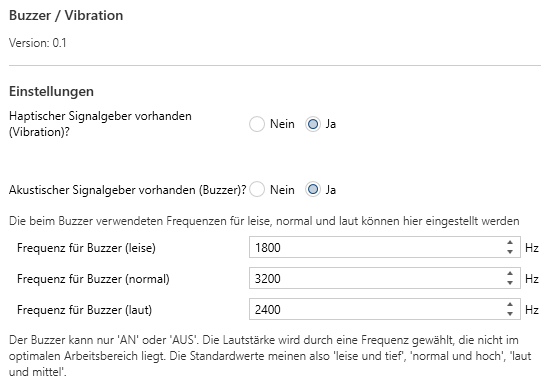
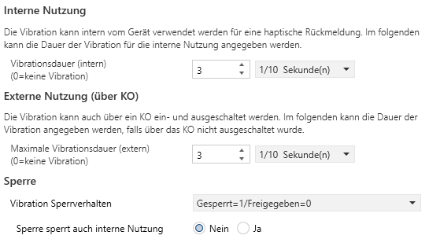
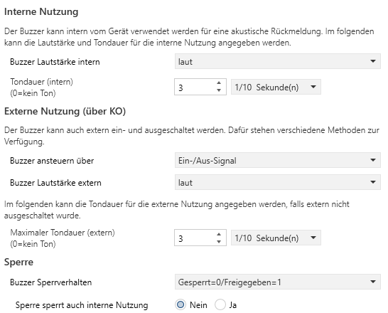

# Applikationsbeschreibung Buzzer/Vibration

Dieses Modul erlaubt die Parametrisierung von akustischen oder haptischen Rückmeldungen eines Gerätes über die ETS.

## Änderungshistorie

Im folgenden werden Änderungen an dem Dokument erfasst, damit man nicht immer das Gesamtdokument lesen muss, um Neuerungen zu erfahren.

28.01.2026 Applikation 0.1, Firmware 0.1.0:

* Initiales Release

## **Einleitung**

<!-- DOC HelpContext="Dokumentation" -->

<!-- DOCCONTENT
Eine vollständige Applikationsbeschreibung ist unter folgendem Link verfügbar: https://github.com/OpenKNX/OFM-Feedback/blob/v1/doc/Applikationsbeschreibung-Feedback.md

DOCCONTENT -->

Dieses Modul besteht aus 2 Teilanwendungen:

* Haptische Rückmeldungen mittels eines Vibrationsmotors
* Akustische Rückmeldungen mittels eines Buzzers

Die angeschlossene Hardware muss einen entsprechenden Buzzer oder Vibrationsmotor enthalten, damit die hier vorgenommen Einstellungen eine Wirkung zeigen.

Folgende Features werden unterstützt:

* 3 unterschiedliche Tonhöhen für akustische Rückmeldungen
* einstellbare Dauer der Rückmeldung
* freie Wahl der Rückmeldeart (haptisch/akustisch/beides/keine)
* externe Steuerung der Rückmeldefunktionen über KO
* bei externer Steuerung ist Dauer und Tonhöhe frei wählbar
* Maximale Ton- und Vibrationsdauer ist einstellbar, falls bei externer Steuerung nicht ausgeschaltet wird.
* Sperren für Vibration und/oder Buzzer sind möglich

## **Allgemein**

Als erstes werden der Modulname **Buzzer/Vibration** und dessen Version angegeben.

<kbd></kbd>

### **Einstellungen**

Hier werden Einstellungen vorgenommen, die für das gesamte Modul gelten.

<!-- DOC -->
#### **Haptischer Signalgeber vorhanden (Vibration)?**

Mit diesem Schalter wird angegeben, ob das Gerät einen Vibrationsmotor installiert hat. Falls nicht, sollte hier **Nein** gewählt werden, da es sonst zu unerwartetem Verhalten beim Gerät kommen kann.

<!-- DOC -->
#### **Akustischer Signalgeber vorhanden (Buzzer)?**

Mit diesem Schalter wird angegeben, ob das Gerät einen Buzzer installiert hat. Falls nicht, sollte hier **Nein** gewählt werden, da es sonst zu unerwartetem Verhalten beim Gerät kommen kann.

Ist ein Buzzer vorhanden, kann man durch weitere Einstellungen die Tonhöhe für leise, normale und laute Töne wählen. Konstruktionsbedingt kann man nicht Tonhöhe und Lautstärke unabhängig einstellen. Jeder Buzzer hat eine Resonanzfrequenz, bei der er am lautesten ist. Weicht man von dieser Resonanzfrequenz ab, wird der Ton leiser. Weiterhin werden tiefere Töne leiser empfunden als hohe. 

Die Standardeinstellungen entsprechen:

* bei **laut** der Resonanzfrequenz, meist ein mittelhoher, gut hörbarer Ton
* **normal** ist höher als die Resonanzfrequenz, ist somit leiser und höher, aber immer noch gut hörbar
* **leise** ist tiefer als die Resonanzfrequenz, wird damit als leise empfunden.

<!-- DOC -->
#### **Frequenz für Buzzer (leise)**

<!-- DOC Skip="1" -->
Erscheint nur, wenn bei "Akustischer Signalgeber vorhanden?" ein Ja angegeben wurde.

Hier kann man die Frequenz (Höhe) des Tons wählen, der bei weiteren Einstellungen als "leiser Ton" wiedergegeben werden soll. 

<!-- DOC -->
#### **Frequenz für Buzzer (normal)**

<!-- DOC Skip="1" -->
Erscheint nur, wenn bei "Akustischer Signalgeber vorhanden?" ein Ja angegeben wurde.

Hier kann man die Frequenz (Höhe) des Tons wählen, der bei weiteren Einstellungen als "normaler Ton" wiedergegeben werden soll. 

<!-- DOC -->
#### **Frequenz für Buzzer (laut)**

<!-- DOC Skip="1" -->
Erscheint nur, wenn bei "Akustischer Signalgeber vorhanden?" ein Ja angegeben wurde.

Hier kann man die Frequenz (Höhe) des Tons wählen, der bei weiteren Einstellungen als "lauter Ton" wiedergegeben werden soll. 

<!-- DOC -->
## **Vibration**

<!-- DOC Skip="3" -->
Erscheint nur, wenn bei "Haptischer Signalgeber vorhanden?" ein Ja angegeben wurde.

<kbd></kbd>

Haptische Rückmeldung mittels Vibration wird häufig bei Touch-Displays verwendet, um eine spürbare Rückmeldung zu bekommen. Sie kann aber auch bei anderen Geräten vorkommen.
<!-- DOCEND -->

### **Interne Nutzung**

Das Gerät kann bei Benutzung (z.B. Betätigung einer Taste) eine fühlbare Rückmeldung geben, in Form einer Vibration, häufig auch als leises Brummen wahrnehmbar.

<!-- DOC -->
#### **Vibrationsdauer (intern)**

Wenn das Gerät eine spürbare Rückmeldung bei Betätigung geben soll, kann man hier die Dauer in 1/10 Sekunden angeben. Eine 0 schaltet die haptische Rückmeldung aus.

### **Externe Nutzung (über KO)**

Die Vibration ist auch über ein KO steuerbar, sie kann darüber ein- und ausgeschaltet werden. 

<!-- DOC -->
#### **Maximale Vibrationsdauer (extern)**

Wird die Vibration über ein KO ein- aber nicht ausgeschaltet, kann hier die maximale Dauer angegeben werden, bevor das Gerät die Vibration von sich aus abschaltet.

### **Sperre**

Die Vibration kann über ein KO gesperrt werden.

<!-- DOC -->
#### **Vibration Sperrverhalten**

Mit dieser Auswahl kann bestimmt werden, ob und wie eine Sperre gesetzt werden kann.

* **Keine Sperre** - Vibration kann nicht gesperrt werden und es erscheint auch kein passendes Sperr-KO
* **Gesperrt=1/Freigegeben=0** - Die Sperre wird durch ein EIN-Signal am Sperr-KO gesetzt
* **Gesperrt=0/Freigegeben=1** - Die Sperre wird durch ein AUS-Signal am Sperr-KO gesetzt

<!-- DOC -->
#### **Sperre sperrt auch interne Nutzung**

Normalerweise werden durch die Sperre nur die Rückmeldungen gesperrt, die durch das externe KO initiiert werden. Durch die Auswahl von "Ja" in diesem Feld werden auch interne Rückmeldungen unterdrückt.

<!-- DOC -->
## **Buzzer**

<!-- DOC Skip="3" -->
Erscheint nur, wenn bei "Akustischer Signalgeber vorhanden?" ein Ja angegeben wurde.

<kbd></kbd>

Akustische Rückmeldung mittels eines Buzzers wird häufig zur Signalisierung von besonderen Zuständen verwendet, vor allem wenn optische Rückmeldung nicht ausreichend ist, z.B. Alarme. Sie kann aber z.B. auch zu einer Rückmeldung eines Tastendrucks verwendet werden.
<!-- DOCEND -->

### **Interne Nutzung**

Das Gerät kann bei Benutzung (z.B. Betätigung einer Taste) eine hörbare Rückmeldung geben. Man kann die Lautstärke und die Dauer einer solchen Rückmeldung bestimmen.

<!-- DOC -->
#### **Buzzer Lautstärke intern**

Die Lautstärke kann in 3 Stufen bestimmt werden:

* **leise** - es wird ein leiser (meist auch tiefer) Ton wiedergegeben
* **normal** - es wird ein normal lauter (meist auch hoher) Ton wiedergegeben
* **laut** - es wird ein lauter Ton (meist mittlere Tonhöhe) wiedergegeben

<!-- DOC -->
#### **Tondauer (intern)**

Wenn das Gerät eine hörbare Rückmeldung geben soll, kann man hier die Dauer in 1/10 Sekunden angeben. Eine 0 schaltet die akustische Rückmeldung aus.

### **Externe Nutzung (über KO)**

Der Buzzer ist auch über ein KO steuerbar, er kann darüber ein- und ausgeschaltet werden. 

<!-- DOC -->
#### **Buzzer ansteuern über**

Die Art, wie der Buzzer extern angesteuert werden kann, kann flexibel bestimmt werden:

* **Ein-/Aus-Signal** - Über ein KO DPT1 wird ein Schaltsignal erwartet. Über einen weiteren Parameter wird die Lautstärke bestimmt.
* **Lautstärke** - Über ein KO DPT5 wird eine Lautstärke vorgegeben: Aus=0, Leise=1, Normal=2, Laut=3
* **Frequenz** - Über ein KO DPT14 wird eine Frequenz vorgegeben, das erlaubt die freie Tonwahl. Frequenz 0 bedeutet aus, der Frequenzbereich liegt zwischen 1500 Hz und 6000 Hz.

<!-- DOC -->
#### **Buzzer Lautstärke extern**

<!-- DOC Skip="1" -->
Erscheint nur, wenn bei "Buzzer ansteuern über" die Ansteuerung als "Ein-/Aus-Signal" angegeben wurde.

Die Lautstärke kann in 3 Stufen bestimmt werden:

* **leise** - es wird ein leiser (meist auch tiefer) Ton wiedergegeben
* **normal** - es wird ein normal lauter (meist auch hoher) Ton wiedergegeben
* **laut** - es wird ein lauter Ton (meist mittlere Tonhöhe) wiedergegeben

<!-- DOC -->
#### **Maximale Tondauer (extern)**

Wird der Buzzer über ein KO ein- aber nicht ausgeschaltet, kann hier die maximale Dauer angegeben werden, bevor das Gerät den Buzzer von sich aus abschaltet.

### **Sperre**

Der Buzzer kann über ein KO gesperrt werden.

<!-- DOC -->
#### **Buzzer Sperrverhalten**

Mit dieser Auswahl kann bestimmt werden, ob und wie eine Sperre gesetzt werden kann.

* **Keine Sperre** - Buzzer kann nicht gesperrt werden und es erscheint auch kein passendes Sperr-KO
* **Gesperrt=1/Freigegeben=0** - Die Sperre wird durch ein EIN-Signal am Sperr-KO gesetzt
* **Gesperrt=0/Freigegeben=1** - Die Sperre wird durch ein AUS-Signal am Sperr-KO gesetzt

<!-- DOC -->
#### **Sperre sperrt auch interne Nutzung**

Normalerweise werden durch die Sperre nur die Rückmeldungen gesperrt, die durch das externe KO initiiert werden. Durch die Auswahl von "Ja" in diesem Feld werden auch interne Rückmeldungen unterdrückt.
